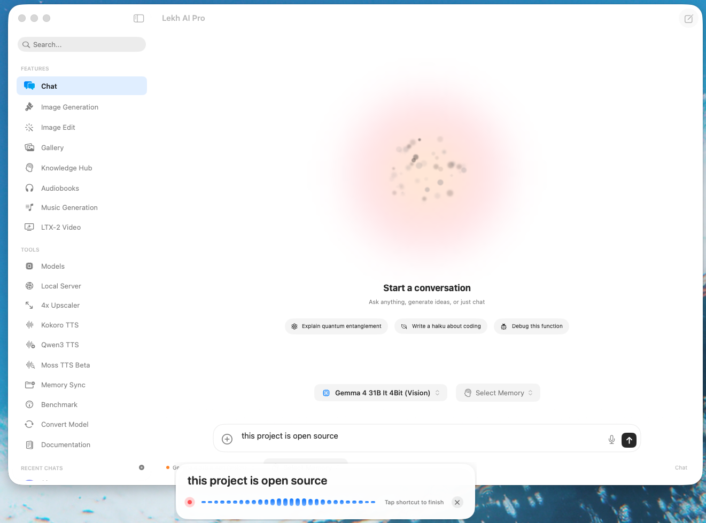

# Lekh Flow

Open-source, system-wide voice dictation for macOS.

`Lekh Flow` is a menu bar app that lets you press a global shortcut, speak naturally, and have text appear where your cursor already is. It is designed to feel like a native dictation layer for your Mac: fast to summon, minimal in UI, private by default, multilingual, and powered by fully on-device speech recognition.

## What It Does

Lekh Flow gives you a floating dictation popup and a system-wide shortcut so you can dictate into whichever app is currently focused.

Core workflow:

1. Press your global shortcut.
2. Start speaking.
3. Watch the live popup confirm that the app is listening.
4. For English dictation, pause briefly and Lekh Flow can commit recognized text continuously.
5. For WhisperKit multilingual dictation, press the shortcut again to commit the final transcript once.
6. Lekh Flow either pastes into the focused app or copies to the clipboard, depending on your settings.

Everything is built around the idea that dictation should feel instant and invisible, not like opening a full recording app every time you want to use your voice.

## Features

- Global hotkey to start and stop dictation from anywhere on macOS
- Floating popup with live transcript feedback and waveform visualization
- On-device English transcription using Parakeet via `FluidAudio`
- Multilingual on-device transcription using `WhisperKit`
- Language-first backend routing: English uses Parakeet, non-English languages use WhisperKit
- System-wide text insertion into the currently focused app
- Copy-to-clipboard mode for workflows where automatic paste is not desired
- Onboarding flow for permissions and shortcut setup
- Menu bar utility design with settings as the primary persistent UI
- Adjustable latency/model settings
- Accessibility + microphone permission handling
- Auto-capitalization for dictated phrases

## Privacy

Lekh Flow is designed around local-first voice transcription.

- Audio is captured locally on your Mac
- Transcription runs on-device using Apple Silicon + Core ML-backed models
- No cloud speech API is required for the core dictation experience

## Screenshot

## Tech Stack

- Swift
- SwiftUI
- AppKit
- `AVAudioEngine` for microphone capture
- [`FluidAudio`](https://github.com/FluidInference/FluidAudio) for streaming Parakeet ASR
- [`WhisperKit`](https://github.com/argmaxinc/WhisperKit) for multilingual on-device Whisper transcription
- [`KeyboardShortcuts`](https://github.com/sindresorhus/KeyboardShortcuts) for global shortcut handling

## Running the Project

### Requirements

- macOS
- Apple Silicon Mac recommended
- Xcode

### Setup

1. Open `Lekh Flow.xcodeproj`
2. Build and run the app
3. Grant microphone permission
4. Grant accessibility permission so Lekh Flow can insert text into other apps
5. Set your preferred global shortcut

## Open Source License

This project is licensed under the **GNU GPL**.

That means derivative works distributed to others must also remain open source under the GPL. If you fork Lekh Flow, modify it, and distribute your version, you are expected to publish the corresponding source code under the same license terms.

## Why Open Source?

Lekh Flow is open source because system-level productivity tools should be inspectable, hackable, and extensible. If you want to improve the popup, change the dictation behavior, swap insertion strategies, or build a different workflow on top of the same core, you can.

## Looking For More Than Open Source Dictation?

Lekh Flow is the open-source utility. If you want polished commercial products from the same team, check out:

### Lekh AI Pro

If you want the paid, flagship experience from the same ecosystem, check out **[Lekh AI Pro](https://lekhai.app/pro)**.

### More From Kaila Labs

Kaila Labs builds privacy-first apps that keep user data on-device whenever possible.

- **[Lekh AI](https://kailalabs.com/apps/lekh-ai-private-assistant/)**  
  Private on-device AI chat, image generation, and vision

- **[Thinklet](https://kailalabs.com/apps/thinklet-ai-voice-notes/)**  
  Voice-first note-taking with on-device AI transcription and intelligent chat

- **[Payoff AI Pro](https://kailalabs.com/apps/payoff-ai-pro/)**  
  Private on-device AI debt management with deep analysis and strategy tools

- **[Veroi AI](https://veroi.ai/)**  
  AI tools from Kaila Labs for creating and launching faster

Learn more at **[kailalabs.com](https://kailalabs.com/)**.

## Notes

- Lekh Flow depends on macOS permissions, especially microphone and accessibility access
- Some insertion behavior depends on how target apps handle synthetic paste / accessibility events
- This project is intended for local, privacy-first dictation workflows on macOS

## Credits

Built by Kaila Labs.

Made with love in Canada.
